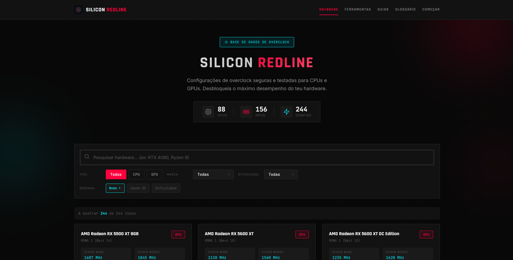

# Silicon Redline

**The Overclock Database** - Uma base de dados completa de configurações de overclock para CPUs e GPUs.



## Sobre o Projeto

Silicon Redline é uma aplicação web que fornece configurações de overclock seguras e testadas para hardware de computador. O projeto oferece:

- **Database de Overclock**: Configurações detalhadas para CPUs e GPUs populares
- **Guias de Overclock**: Tutoriais passo-a-passo para iniciantes e avançados
- **Ferramentas de Overclock**: Links para software essencial (MSI Afterburner, Intel XTU, Ryzen Master, etc.)
- **Glossário de Overclock**: Termos técnicos explicados de forma simples
- **Comparador de Hardware**: Compare especificações e potencial de overclock lado a lado

## Tecnologias

- React 18
- Vite
- CSS3 (design system customizado)
- PWA (Progressive Web App)

## Instalação

```bash
# Clonar o repositório
git clone https://github.com/username/silicon-redline.git

# Entrar no diretório
cd silicon-redline

# Instalar dependências
npm install

# Iniciar servidor de desenvolvimento
npm run dev
```

## Build para Produção

```bash
# Gerar build otimizado
npm run build

# Preview do build
npm run preview
```

## Estrutura do Projeto

```
silicon-redline/
├── public/
│   ├── favicon.svg
│   ├── manifest.json
│   └── icon-*.png
├── src/
│   ├── assets/
│   ├── components/
│   │   ├── Header.jsx
│   │   ├── Footer.jsx
│   │   ├── Icons.jsx
│   │   └── ...
│   ├── pages/
│   │   ├── ToolsPage.jsx
│   │   ├── GuidesHub.jsx
│   │   ├── Glossary.jsx
│   │   ├── HardwareDetail.jsx
│   │   ├── HardwareComparator.jsx
│   │   └── ...
│   ├── App.jsx
│   ├── main.jsx
│   └── index.css
├── hardware.json
├── index.html
├── package.json
└── vite.config.js
```

## Funcionalidades

### Database de Overclock
- Pesquisa por modelo, marca ou arquitetura
- Filtros por tipo (CPU/GPU) e dificuldade de overclock
- Configurações detalhadas com clocks, voltagens e temperaturas recomendadas

### Guias de Overclock
- Guias específicos por software (MSI Afterburner, Intel XTU, Ryzen Master, BIOS)
- Níveis de dificuldade: Iniciante, Médio, Avançado
- Instruções passo-a-passo com configurações seguras

### Comparador de Overclock
- Compare até 2 peças de hardware lado a lado
- Visualize diferenças em especificações stock vs overclock
- Analise potencial de ganho de overclock

### PWA
- Instalável como aplicação nativa
- Funciona offline (com cache)
- Responsivo para mobile e desktop

## Configuração de Overclock

Cada entrada na database inclui:

- **Especificações Stock**: Clock base, boost, TDP, VRAM/Cores
- **Configuração de Overclock Recomendada**: Clock alvo, voltagem segura, temperatura máxima
- **Ganho Estimado**: Percentagem de melhoria de performance
- **Dificuldade**: Classificação do nível de risco do overclock
- **Software Recomendado**: Programa e configurações específicas

## Deploy

O projeto pode ser hospedado em qualquer serviço de hosting estático:

### GitHub Pages

```bash
# Build do projeto
npm run build

# Os ficheiros estarão em /dist
# Fazer push para branch gh-pages ou configurar GitHub Pages para /dist
```

### Vercel / Netlify

1. Conectar o repositório GitHub
2. Configurar build command: `npm run build`
3. Configurar output directory: `dist`

## Licença

MIT License - Ver ficheiro LICENSE para detalhes.

## Contribuições

Contribuições são bem-vindas. Para adicionar novo hardware à database de overclock:

1. Editar `hardware.json`
2. Seguir o schema existente
3. Incluir configurações de overclock testadas e seguras
4. Submeter Pull Request

---

**Aviso**: Overclock pode danificar hardware se feito incorretamente. As configurações fornecidas são recomendações baseadas em testes da comunidade. Utilize por sua conta e risco.
